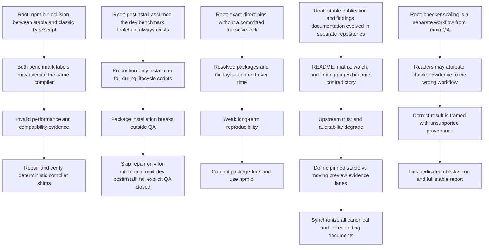

# TypeScript 7 stable review council — causal adjudication

## Scope

This review council evaluated two pull requests at frozen pre-fix heads:

- `safal207/typescript-7-rc-qa-benchmark#11` at `7a6c5ff9e2adc513bb66135bcfd19c5c59bf4ef8`
- `safal207/typescript-go-qa-findings#15` at `3206fe04b73ffc819143f47540bfd734ccbe2490`

Review lanes:

- **CodeRabbit** — source-PR summary and inline review
- **Qodo** — source-PR summary and inline review
- **Grok 4.5** — frozen external patch review through `safal207/LS#863`
- **Human adjudication** — reproduction against the current files, causal collapse, and minimal fixes

Grok evidence artifact:

- Workflow: `safal207/LS` run `29123754245`
- Artifact: `8239524346`
- Digest: `sha256:80144ea7134f5e4f6e07034ac075e83830b164807df31b2a6f25a4815576dbc7`

## Reviewer proposals

| Reviewer | Proposal | Adjudication | Action |
|---|---|---|---|
| Qodo | `postinstall` assumed devDependencies and could break `npm install --omit=dev` | **True** | Postinstall now skips only when the dev toolchain is intentionally absent; explicit QA verification still fails closed. Added a production-only install CI contract. |
| Grok | Exact direct pins were insufficient without a lockfile and `npm ci` | **True** | Added `package-lock.json`; stable QA and checker-scaling workflows now use `npm ci`. |
| CodeRabbit + Qodo | Findings matrix did not clearly name exact compared versions or explain where those exact results came from | **True** | Matrix now names TypeScript 6.0.3 and 7.0.2 and separates pinned stable evidence from moving preview dependencies. |
| CodeRabbit | Upstream watch did not record the HTTP 403 posting failure or preserved draft | **True** | README, matrix, upstream watch, and finding document now record the blocked attempt and link the reviewed draft. |
| Qodo | Linked `#1493` and `#4435` finding pages remained stale | **True** | Both finding pages were rewritten to match stable evidence and the Working As Intended resolution. |
| Grok | Findings still said the full stable profile was required after it had already been published | **True** | Removed stale gate language and linked the dated full report and run. |
| Grok | Checker-scaling claims were unsupported because checker scaling is not part of `npm run qa` | **Partially true** | It is correctly separate from `qa`, but it did run cross-platform. Claims now cite the dedicated run `29121518759` rather than infer it from the main QA workflow. |
| CodeRabbit | PR #11 had no additional actionable code findings | **Non-action** | No style-only changes were introduced. |
| Grok | One-time full-evidence job was added and removed | **Intentional** | The run, commit, report, artifacts, and digests remain the immutable evidence record; no permanent duplicate job was restored. |
| Grok | Add further package-layout assertions | **Optional / not required** | Current guard already fails closed if package entrypoints or commands disappear. Lockfile plus `npm ci` reduces this residual risk. |

## Root-cause graph



## Implemented solution

### Benchmark repository

- Added a lockfile generated on Node.js 22 from the pinned dependency set.
- Switched stable QA and checker-scaling workflows from `npm install` to `npm ci`.
- Added compiler verification to the checker-scaling workflow.
- Updated the shim guard to support `--omit=dev` installation without weakening explicit QA verification.
- Added a CI job proving:
  - `npm ci --omit=dev` succeeds;
  - `npm run verify:compiler-selection` fails when the benchmark toolchain is absent.
- Updated README and stable-validation documentation.

### Findings repository

- Named exact TypeScript 6.0.3 and TypeScript 7.0.2 columns.
- Made exact-version provenance explicit.
- Kept local `latest` dependencies as a clearly labelled continuous preview lane.
- Linked the full stable report, stable workflow, checker-scaling workflow, and upstream draft.
- Updated `#1493`, `#4435`, and `#4406` finding documents.
- Removed stale claims that the full stable profile was still pending.

## Validation gates

The final heads must pass:

1. `npm ci` on Ubuntu, Windows, and macOS.
2. Compiler-selection verification on every stable QA runner.
3. Stable smoke QA and normalized output parity.
4. Dedicated checker-scaling workflow on all three operating systems.
5. Production-only install contract.
6. Findings repository QA workflow.
7. A final review-thread audit confirming that addressed findings are resolved or explicitly answered.

## Decision

The council's causal solution is to fix evidence integrity at the root rather than patch individual sentences repeatedly:

```text
locked installation
  + deterministic compiler identity
  + explicit evidence provenance
  + synchronized status documents
  + workflow-specific citations
  = reproducible and auditable TypeScript 7 stable evidence
```

No reviewer has merge authority. Merge readiness depends on the final CI and review-thread gates above.
